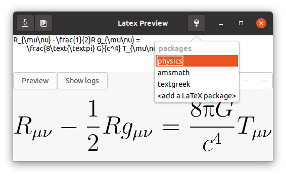

# Latex Preview

Quickly and effortlessly preview Latex equations, save them to a `.gif`
file, copy them to clipboard, or drag them to a document.



## Dependencies

The following packages are _required_.
* `python3`
* `python3-gi`
* an installation of `latex`
* `dvipng`

> __Note:__ At the moment, only environments with `nautilus` are 
> supported for the clipboard. Contributions are welcome so as to 
> expand this feature for other desktop environments.
> This only affects pasting the image to a file browser;
> the program should always work with Libre/Open/MS Office.

## Installation

Simply clone this repository, or download it.

Make sure you extract everything in the same folder, then you can 
simply run the program:
```shell
$ python3 latexpreview.py
```

## Use

Every control is pretty much intuitive. Hover the mouse over a button
to know its shortcut and what it does. You can resize the preview, 
change its color, copy the image to clipboard or save it.

You can also add __extra packages__ for latex that will be used by the
program (c.f. image above).

Hope you enjoy!
