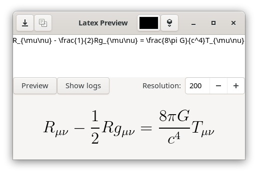
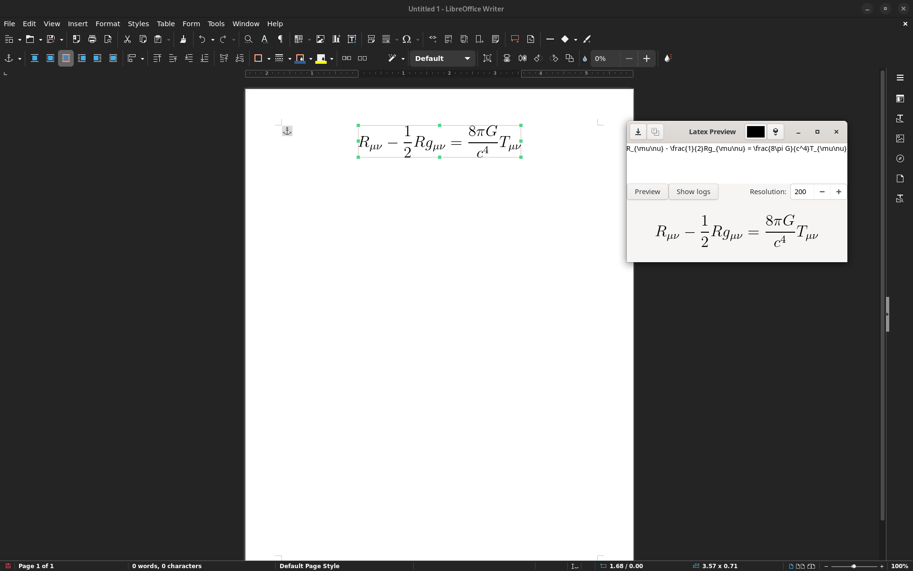

# Latex Preview

Quickly and effortlessly preview Latex equations, save them to a `.gif`
file, copy them to clipboard, or drag them to a document.




## Dependencies

The following packages are _required_.

* `python3`
* `texlive` (or any installation of latex)
* `python3-gi`
* `gobject-introspection`
* `gir1.2-gtk-3.0`
* `dvipng`

Alternatively, you can use `docker` to build a docker image
from the supplied Dockerfile.

## Installation

Simply clone this repository, or download it.
```shell
$ git clone https://github.com/sbacco/LatexPreview.git
```
If you have all the dependencies installed, you can run the
program with,
```shell
$ cd LatexPreview
$ python3 latexpreview.py
```
Otherwise, with docker (this can take a while):
```shell
$ docker image build --pull --file Dockerfile
```
A helper script is provided to help you run the docker image.
Make it executable,
```shell
$ chmod +x latexpreview.sh
```
And run the app like so,
```shell
$ ./latexpreview.sh
```
## Use

Every control is pretty much intuitive. Hover the mouse over a button
to know its shortcut and what it does. You can resize the preview, 
change its color, copy the image to clipboard or save it.

You can also add __extra packages__ for latex that will be used by the
program (c.f. image above). The docker container comes with many
extra latex packages preinstalled.

Hope you enjoy!
